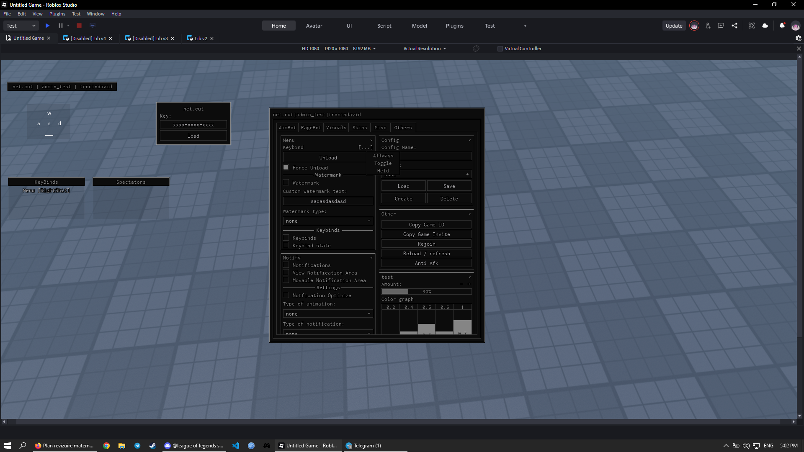

# 📦 NetCut UI Library – Full Usage Guide

## 🧠 Overview

This library is a **custom Roblox UI framework** that lets you build:

* Windows
* Tabs
* Sections (Frames)
* Buttons
* Toggles
* Keybinds
* Notifications
* Watermarks

Built with:

* OOP-style (`Util`)
* Theme system
* Tween animations
* Signal system

---

# 🚀 Setup

### Load your script

```lua
repeat task.wait() until game:IsLoaded()

local library = loadstring(game:HttpGet("YOUR_GITHUB_RAW_LINK"))()
```

---

# 🪟 Creating a Window

```lua
local window = Util:Window({
    Name = "MyUI",
    Size = UDim2.fromOffset(516, 516)
})
```

---

# 📑 Tabs

```lua
local tab = window:CreateTab({
    Name = "Main"
})
```

### Behavior:

* First tab auto-selected
* Click switches tabs

---

# 📦 Sections (Frames)

```lua
local section = tab:CreateFrame({
    Text = "Player Settings",
    Side = "left", -- "left" or "right"
    SizeY = 200
})
```

---

# 🔘 Button

```lua
section:CreateButton({
    Text = "Click Me",
    CallBack = function()
        print("Clicked!")
    end
})
```

---

# 🔁 Toggle

```lua
section:CreateToggle({
    Name = "Enable Feature",
    CallBack = function(state)
        print("State:", state)
    end
})
```

---

# ⌨️ Keybind

```lua
section:CreateKeyBind({
    Text = "Toggle UI",
    KeyBindType = "Toggle", -- Toggle / Held / Allways
    Options = "All", -- Enables right-click menu
    CallBack = function(state)
        print("Keybind:", state)
    end
})
```

### Keybind Types:

| Type    | Behavior             |
| ------- | -------------------- |
| Toggle  | Press = ON/OFF       |
| Held    | Active while holding |
| Allways | Toggles permanently  |

---

# 🔔 Notifications

```lua
window:Notify("Hello World", 3)
```

### Behavior:

* Slides in
* Auto disappears
* Animated text removal

---

# 🧾 Keybind UI

```lua
window:CreateKeyBindUi()

window:KeyBindsVisible()
```

### Add label manually:

```lua
window:AddKeybindLabel("Fly", "F")
```

---

# 🏷 Watermark

```lua
local watermark = window:CreateWatermarkUi()

window:WatermarkVisible()

window:Update({"Username", "ScriptName"})
```

---

# 🎨 Themes

### Available themes:

```lua
Util.themes = {
    usual,
    dark_minimalistic,
    cybepunk,
    neon,
    pastel,
    monochrome,
    ocean,
    fire
}
```

### Example:

```lua
Util.themeSignal:Fire("neon")
```

---

# 🧩 Layout System

Each tab has 2 columns:

```lua
"left"
"right"
```

You choose via:

```lua
Side = "left" or "right"
```

---

# 🛠 Utility Functions

### Create UI element

```lua
Util:Create("Frame", {
    BackgroundColor3 = Color3.new(1,1,1)
})
```

---

### Draggable UI

```lua
Util:MakeFrameDraggable(frame)
```

---

### Text size

```lua
Util:GetTextBounds("Hello", Font.new(...), 13)
```

---

### Random string

```lua
Util:RandomString(10)
```

---

### Cleanup

```lua
Util:Unload()
```

---

# ⚙️ Internal Systems

### Signals

```lua
Util.signal
Util.unloadedSignal
Util.themeSignal
```

---

### Connection manager

```lua
Util:Connection(signal, function)
```

(auto stored and cleaned on unload)

---

# 🎯 Full Example

```lua
local window = Util:Window({Name = "Demo"})

local tab = window:CreateTab({Name = "Main"})

local section = tab:CreateFrame({
    Text = "Gameplay",
    Side = "left",
    SizeY = 200
})

section:CreateButton({
    Text = "Print",
    CallBack = function()
        print("Hello")
    end
})

section:CreateToggle({
    Name = "GodMode",
    CallBack = function(v)
        print(v)
    end
})

section:CreateKeyBind({
    Text = "Toggle Feature",
    KeyBindType = "Toggle",
    CallBack = function(v)
        print("Key:", v)
    end
})
```

---

# 📌 Structure

```
Util
 └── Window
      └── Tab
           └── Frame
                ├── Button
                ├── Toggle
                └── KeyBind
```

---

# ✅ Done

You now have a fully modular UI system with:

* Themes
* Animations
* Keybind system
* Notifications
* Clean structure

---
